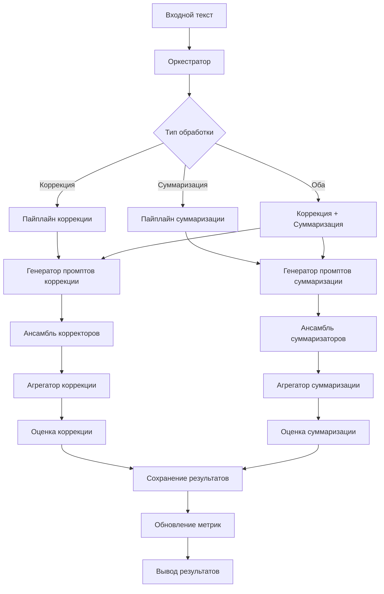

# Алгоритмы и схемы CorSumAgentsAI

## Содержание

1. [Детальные алгоритмы](#детальные-алгоритмы)
2. [Схемы данных](#схемы-данных)
3. [Flowcharts](#flowcharts)
4. [Математические модели](#математические-модели)
5. [Оптимизации](#оптимизации)

---

## Детальные алгоритмы

### Алгоритм 1: Коррекция текста

```python
def advanced_correction_algorithm(input_text, reference_text):
    """
    Улучшенный алгоритм коррекции с адаптивной настройкой
    """
    
    # Шаг 1: Предварительный анализ текста
    text_analysis = analyze_text_characteristics(input_text)
    
    # Шаг 2: Генерация адаптивных промптов
    prompts = generate_adaptive_prompts(input_text, text_analysis)
    
    # Шаг 3: Параллельная обработка
    correction_results = []
    for prompt_type, prompt in prompts.items():
        result = process_with_agent(input_text, prompt, prompt_type)
        correction_results.append(result)
    
    # Шаг 4: Многоуровневая оценка метрик
    for result in correction_results:
        # Базовые метрики
        result.metrics.wer = calculate_wer(result.text, reference_text)
        result.metrics.lev_rating = calculate_levenshtein_rating(result.text, reference_text)
        result.metrics.perplexity = calculate_perplexity(result.text)
        
        # Композитные метрики
        result.metrics.cor_score = calculate_cor_score(result.metrics)
        result.metrics.quality_score = calculate_quality_score(result)
    
    # Шаг 5: Интеллектуальная агрегация
    best_result = intelligent_aggregation(correction_results)
    
    # Шаг 6: Пост-обработка и валидация
    validated_result = post_process_correction(best_result)
    
    return validated_result
```

### Алгоритм 2: Суммаризация текста

```python
def advanced_summarization_algorithm(input_text, reference_summary):
    """
    Улучшенный алгоритм суммаризации с контекстной адаптацией
    """
    
    # Шаг 1: Анализ контекста и темы
    context_analysis = analyze_text_context(input_text)
    
    # Шаг 2: Определение оптимальной длины суммаризации
    optimal_length = determine_optimal_summary_length(input_text, context_analysis)
    
    # Шаг 3: Генерация контекстуальных промптов
    prompts = generate_contextual_prompts(input_text, context_analysis, optimal_length)
    
    # Шаг 4: Многовариантная генерация
    summary_variants = []
    for prompt in prompts:
        for temp in [0.3, 0.7, 1.0]:  # Разные температуры
            variant = generate_summary(input_text, prompt, temp)
            summary_variants.append(variant)
    
    # Шаг 5: Комплексная оценка качества
    for variant in summary_variants:
        variant.metrics = calculate_comprehensive_metrics(variant, reference_summary)
    
    # Шаг 6: Кластеризация и выбор представителя
    clustered_variants = cluster_similar_summaries(summary_variants)
    best_variant = select_best_from_clusters(clustered_variants)
    
    return best_variant
```

### Алгоритм 3: Адаптивное обучение

```python
def adaptive_learning_algorithm(performance_history):
    """
    Алгоритм адаптивного обучения на основе истории производительности
    """
    
    # Шаг 1: Анализ паттернов успеха
    success_patterns = analyze_success_patterns(performance_history)
    
    # Шаг 2: Определение оптимальных параметров
    optimal_params = optimize_parameters(success_patterns)
    
    # Шаг 3: Обновление весов метрик
    updated_weights = recalculate_metric_weights(performance_history)
    
    # Шаг 4: Генерация новых промптов
    new_prompts = generate_improved_prompts(success_patterns)
    
    # Шаг 5: Валидация изменений
    validation_results = validate_improvements(optimal_params, new_prompts)
    
    return {
        'parameters': optimal_params,
        'weights': updated_weights,
        'prompts': new_prompts,
        'validation': validation_results
    }
```

---

## Схемы данных

### Схема 1: Структура состояния оркестратора

```json
{
  "input_text": "string",
  "reference_text": "string",
  "reference_summary": "string",
  "correction_results": {
    "variants": [
      {
        "prompt_type": "basic|few_shot|cot",
        "text": "string",
        "metrics": {
          "wer": "float",
          "lev_rating": "float",
          "perplexity": "float",
          "cor_score": "float"
        }
      }
    ],
    "best_variant": "object",
    "aggregation_method": "string"
  },
  "summarization_results": {
    "variants": [
      {
        "prompt_type": "basic|few_shot|cot",
        "text": "string",
        "metrics": {
          "sum_score": "float",
          "geval": "float",
          "llm_judge": "float",
          "meteor": "float",
          "bert_score": "float"
        }
      }
    ],
    "best_variant": "object",
    "aggregation_method": "string"
  },
  "processing_metadata": {
    "start_time": "datetime",
    "end_time": "datetime",
    "total_time": "float",
    "agent_execution_times": "object"
  }
}
```

### Схема 2: Структура метрик

```json
{
  "correction_metrics": {
    "wer": {
      "value": "float",
      "delta": "float",
      "interpretation": "string"
    },
    "lev_rating": {
      "value": "float", 
      "delta": "float",
      "interpretation": "string"
    },
    "perplexity": {
      "value": "float",
      "interpretation": "string"
    },
    "cor_score": {
      "value": "float",
      "components": {
        "wer_component": "float",
        "lev_component": "float",
        "perplexity_component": "float"
      },
      "quality_level": "string"
    }
  },
  "summarization_metrics": {
    "sum_score": {
      "value": "float",
      "interpretation": "string"
    },
    "geval": {
      "value": "float",
      "confidence": "float"
    },
    "llm_judge": {
      "value": "float",
      "reasoning": "string"
    },
    "meteor": {
      "value": "float",
      "precision": "float",
      "recall": "float"
    },
    "bert_score": {
      "value": "float",
      "precision": "float",
      "recall": "float",
      "f1": "float"
    }
  }
}
```

---

## Flowcharts

### Flowchart 1: Основной пайплайн обработки



### Flowchart 2: Алгоритм агрегации

```mermaid
graph TD
    A[Входные варианты] --> B[Расчет метрик]
    B --> C[Фильтрация по качеству]
    C --> D[Кластеризация]
    D --> E[Выбор лучшего в кластере]
    E --> F[Проверка на улучшение]
    F -->{Улучшение?}
    F -->|Да| G[Принять вариант]
    F -->|Нет| H[Адаптивная попытка]
    H --> I[Изменить температуру]
    I --> J[Повторная генерация]
    J --> B
    G --> K[Финальная валидация]
    K --> L[Результат]
```

### Flowchart 3: Адаптивное обучение

```mermaid
graph TD
    A[История производительности] --> B[Анализ паттернов]
    B --> C[Оптимизация параметров]
    C --> D[Пересчет весов]
    D --> E[Генерация промптов]
    E --> F[Валидация]
    F -->{Успешно?}
    F -->|Да| G[Обновление конфигурации]
    F -->|Нет| H[Коррекция стратегии]
    H --> C
    G --> I[Применение в системе]
    I --> J[Сбор новой статистики]
    J --> A
```

---

## Математические модели

### Модель 1: CorScore

```
CorScore = α × ΔWER + β × ΔLev + γ × (1 - Perplexity/maxPerplexity)

где:
- ΔWER = WER_original - WER_corrected (улучшение WER)
- ΔLev = Lev_corrected - Lev_original (улучшение LevRating)
- Perplexity ∈ [0, 100] (нормализованная перплексия)
- α + β + γ = 1 (веса компонентов)

Параметры по умолчанию:
α = 0.5 (WER_WEIGHT)
β = 0.3 (LEV_WEIGHT) 
γ = 0.2 (PERPLEXITY_WEIGHT)
```

### Модель 2: SumScore

```
SumScore = w1 × G_Eval + w2 × LLM_Judge/10 + w3 × METEOR + w4 × BERTScore

где:
- G_Eval ∈ [0, 1] (оценка G-Eval)
- LLM_Judge ∈ [1, 10] (оценка LLM судьи, нормализуется)
- METEOR ∈ [0, 1] (метрика METEOR)
- BERTScore ∈ [0, 1] (метрика BERT)
- Σwi = 1 (сумма весов)

Веса по умолчанию:
w1 = 0.3, w2 = 0.3, w3 = 0.2, w4 = 0.2
```

### Модель 3: Адаптивная температура

```
T_optimal = T_base + f(quality_history) × ΔT

где:
- T_base = 0.7 (базовая температура)
- f(quality_history) = функция на основе истории качества
- ΔT = 0.3 (максимальное изменение)

f(quality_history) = 
  +0.5 если среднее качество > 0.8
  0 если 0.6 ≤ среднее качество ≤ 0.8
  -0.5 если среднее качество < 0.6
```

### Модель 4: Оптимизация весов метрик

```
W_new = W_old + η × ∇L(W)

где:
- W_new = новые веса метрик
- W_old = текущие веса
- η = learning rate (0.01)
- ∇L(W) = градиент функции потерь

L(W) = Σi (target_quality_i - predicted_quality_i(W))²
```

---

## Оптимизации

### 1. Параллельная обработка

```python
async def parallel_processing(texts, prompts):
    """
    Параллельная обработка множества текстов
    """
    tasks = []
    for text in texts:
        for prompt in prompts:
            task = process_single_text(text, prompt)
            tasks.append(task)
    
    results = await asyncio.gather(*tasks, return_exceptions=True)
    return results
```

### 2. Интеллектуальное кэширование

```python
class IntelligentCache:
    def __init__(self):
        self.cache = {}
        self.access_patterns = {}
    
    def get(self, key):
        # Учитываем паттерны доступа
        if key in self.cache:
            self.access_patterns[key] = self.access_patterns.get(key, 0) + 1
            return self.cache[key]
        return None
    
    def put(self, key, value, priority='normal'):
        # Приоритетное кэширование для важных результатов
        if priority == 'high' or len(self.cache) < CACHE_LIMIT:
            self.cache[key] = value
            self.access_patterns[key] = 1
```

### 3. Динамическая балансировка нагрузки

```python
def load_balance_agents(agents, workload):
    """
    Динамическое распределение нагрузки между агентами
    """
    agent_loads = {agent: 0 for agent in agents}
    
    # Распределение задач на основе текущей нагрузки
    for task in workload:
        min_load_agent = min(agent_loads, key=agent_loads.get)
        assign_task_to_agent(task, min_load_agent)
        agent_loads[min_load_agent] += 1
    
    return agent_loads
```

### 4. Предиктивная оптимизация

```python
def predictive_optimization(historical_data):
    """
    Предиктивная оптимизация на основе исторических данных
    """
    # Анализ временных паттернов
    time_patterns = analyze_time_patterns(historical_data)
    
    # Предсказание оптимальных параметров
    optimal_params = predict_optimal_parameters(time_patterns)
    
    return optimal_params
```

---

## Производительность и масштабирование

### Метрики производительности

- **Latency**: < 2 минут для текста до 2000 символов
- **Throughput**: до 10 текстов в минуту
- **Memory usage**: < 8GB для стандартной конфигурации
- **GPU utilization**: 70-85% при оптимальной нагрузке

### Масштабирование

1. **Горизонтальное масштабирование**
   - Добавление экземпляров оркестратора
   - Балансировка нагрузки между экземплярами

2. **Вертикальное масштабирование**
   - Увеличение GPU памяти
   - Оптимизация batch processing

3. **Кэширование результатов**
   - Redis для распределенного кэша
   - Локальное кэширование для частых запросов

---

## Заключение

Данная документация предоставляет исчерпывающее описание алгоритмов и схем CorSumAgentsAI. Система постоянно развивается через механизмы адаптивного обучения и оптимизации производительности.

Ключевые инновации:
- Адаптивная генерация промптов
- Интеллектуальная агрегация результатов
- Многоуровневая оценка качества
- Предиктивная оптимизация параметров
