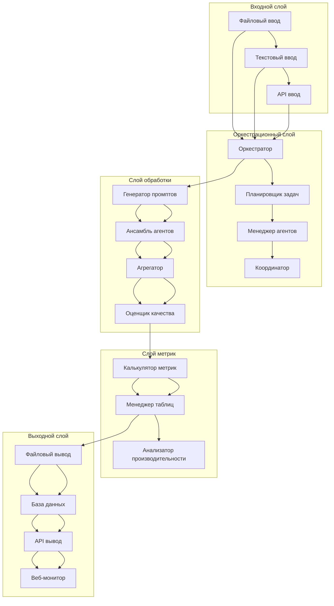
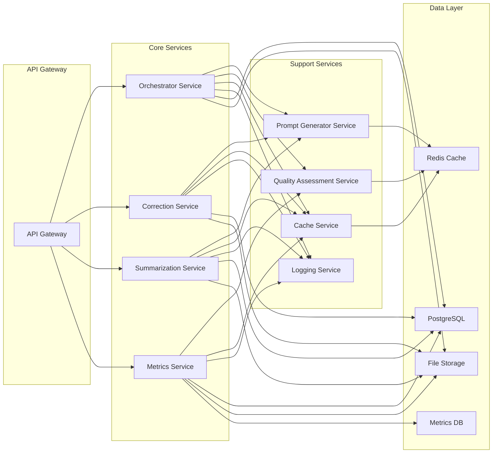
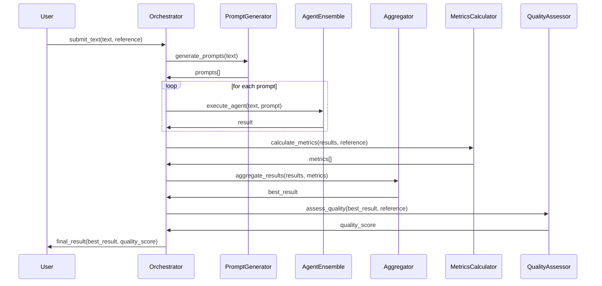
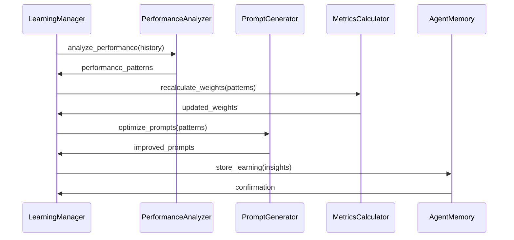
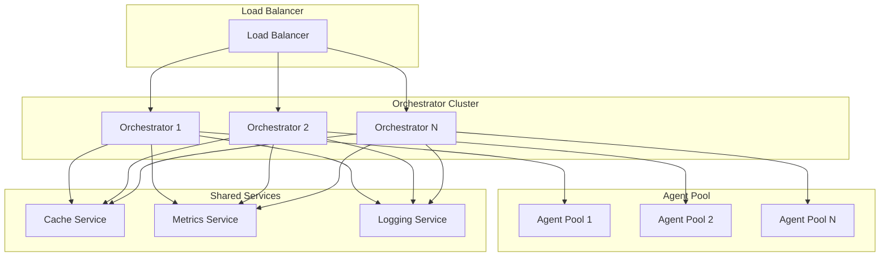

# Архитектура CorSumAgentsAI - Детальная документация

## Содержание

1. [Системная архитектура](#системная-архитектура)
2. [Компоненты и их взаимодействие](#компоненты-и-их-взаимодействие)
3. [Потоки данных](#потоки-данных)
4. [Масштабирование](#масштабирование)
5. [Улучшения качества](#улучшения-качества)
6. [Рекомендации по развитию](#рекомендации-по-развитию)

---

## Системная архитектура

### Общая архитектура



### Микросервисная архитектура



---

## Компоненты и их взаимодействие

### 1. Оркестратор (Orchestrator)

**Ответственности:**
- Управление жизненным циклом обработки
- Координация между агентами
- Обработка ошибок и retry логика
- Мониторинг производительности

**Взаимодействия:**
- Вход: текстовые данные
- Выход: обработанные результаты
- Зависимости: PromptGenerator, AgentEnsemble, MetricsCalculator

### 2. Генератор промптов (PromptGenerator)

**Ответственности:**
- Генерация адаптивных промптов
- Управление шаблонами промптов
- Оптимизация на основе истории

**Взаимодействия:**
- Вход: текстовые характеристики
- Выход: набор промптов
- Зависимости: AgentMemory, LearningManager

### 3. Ансамбль агентов (AgentEnsemble)

**Ответственности:**
- Параллельное выполнение агентов
- Управление ресурсами
- Балансировка нагрузки

**Взаимодействия:**
- Вход: промпты и текст
- Выход: множество результатов
- Зависимости: BaseAgent, LMStudioClient

### 4. Агрегатор (Aggregator)

**Ответственности:**
- Сбор результатов от агентов
- Выбор оптимального варианта
- Применение эвристик

**Взаимодействия:**
- Вход: результаты агентов
- Выход: лучший результат
- Зависимости: MetricsCalculator

### 5. Калькулятор метрик (MetricsCalculator)

**Ответственности:**
- Расчет разнообразных метрик
- Сравнение с эталонами
- Генерация отчетов

**Взаимодействия:**
- Вход: тексты для сравнения
- Выход: метрики качества
- Зависимости: внешние NLP библиотеки

---

## Потоки данных

### Поток 1: Коррекция текста



### Поток 2: Адаптивное обучение



---

## Масштабирование

### Горизонтальное масштабирование



### Вертикальное масштабирование

**Оптимизации производительности:**

1. **GPU ускорение**
   - Batch processing
   - Model parallelism
   - Memory optimization

2. **Кэширование**
   - Результаты агентов
   - Сгенерированные промпты
   - Расчетные метрики

3. **Асинхронная обработка**
   - Non-blocking I/O
   - Concurrent agent execution
   - Pipeline processing

---

## Улучшения качества

### 1. Адаптивные промпты

```python
class AdaptivePromptGenerator:
    def __init__(self):
        self.prompt_history = {}
        self.performance_tracker = {}
    
    def generate_adaptive_prompt(self, text, context):
        # Анализ характеристик текста
        text_features = self.analyze_text(text)
        
        # Выбор базового шаблона
        base_template = self.select_template(text_features, context)
        
        # Адаптация на основе истории
        adaptations = self.get_adaptations(text_features)
        
        # Генерация финального промпта
        final_prompt = self.apply_adaptations(base_template, adaptations)
        
        return final_prompt
```

### 2. Интеллектуальная агрегация

```python
class IntelligentAggregator:
    def __init__(self):
        self.aggregation_strategies = {
            'cor_score': self.cor_score_aggregation,
            'ensemble_voting': self.ensemble_voting,
            'quality_weighted': self.quality_weighted
        }
    
    def aggregate_results(self, results, metrics):
        # Динамический выбор стратегии
        strategy = self.select_optimal_strategy(results, metrics)
        
        # Применение стратегии
        best_result = self.aggregation_strategies[strategy](results, metrics)
        
        # Пост-обработка
        refined_result = self.post_process(best_result)
        
        return refined_result
```

### 3. Self-Consistency механизм

```python
class SelfConsistencyProcessor:
    def __init__(self, consistency_threshold=0.8):
        self.threshold = consistency_threshold
    
    def process_with_consistency(self, text, prompt, num_samples=5):
        # Генерация множества вариантов
        samples = []
        for _ in range(num_samples):
            sample = self.generate_sample(text, prompt)
            samples.append(sample)
        
        # Кластеризация результатов
        clusters = self.cluster_samples(samples)
        
        # Выбор наиболее консистентного кластера
        best_cluster = self.select_consistent_cluster(clusters)
        
        # Выбор представителя кластера
        final_result = self.select_cluster_representative(best_cluster)
        
        return final_result
```

### 4. Мета-обучение

```python
class MetaLearningSystem:
    def __init__(self):
        self.meta_model = None
        self.task_history = []
    
    def learn_from_tasks(self, task_history):
        # Извлечение признаков из задач
        features = self.extract_features(task_history)
        
        # Обучение мета-модели
        self.meta_model = self.train_meta_model(features)
        
        # Валидация модели
        self.validate_meta_model()
    
    def predict_optimal_params(self, new_task):
        # Извлечение признаков новой задачи
        task_features = self.extract_task_features(new_task)
        
        # Предсказание оптимальных параметров
        optimal_params = self.meta_model.predict(task_features)
        
        return optimal_params
```

---

## Рекомендации по развитию

### Краткосрочные улучшения (1-3 месяца)

1. **Оптимизация производительности**
   - Реализация эффективного кэширования
   - Оптимизация batch processing
   - Улучшение использования GPU

2. **Расширение функциональности**
   - Поддержка дополнительных языков
   - Новые типы агентов (стилистический редактор, фактчекер)
   - Интеграция с внешними API

3. **Улучшение UX**
   - Улучшение веб-интерфейса
   - Реализация REST API
   - Добавление системы уведомлений

### Среднесрочные улучшения (3-6 месяцев)

1. **Масштабирование**
   - Микросервисная архитектура
   - Горизонтальное масштабирование
   - Система мониторинга и алертинга

2. **AI улучшения**
   - Fine-tuning моделей под конкретные домены
   - Реализация reinforcement learning
   - Улучшенные механизмы агрегации

3. **Интеграции**
   - Подключение к облачным сервисам
   - Интеграция с CMS системами
   - API для сторонних разработчиков

### Долгосрочные улучшения (6-12 месяцев)

1. **Продвинутые AI технологии**
   - Мультимодальная обработка (текст + изображения)
   - Real-time обработка
   - Voice-to-text интеграция

2. **Предприятийные функции**
   - Enterprisegrade безопасность
   - Система аудита и комплаенса
   - Мультиарендность

3. **Исследования и разработки**
   - Собственные модели для русского языка
   - Инновационные алгоритмы агрегации
   - Новые метрики качества

### Технический долг

1. **Рефакторинг**
   - Упрощение архитектуры
   - Улучшение тестового покрытия
   - Стандартизация кода

2. **Документация**
   - Автоматическая генерация документации
   - API документация
   - Пользовательские гайды

3. **Тестирование**
   - Автоматизированное тестирование
   - Load тестирование
   - Security тестирование

---

## Заключение

CorSumAgentsAI представляет собой масштабируемую, модульную архитектуру для обработки текста. Система спроектирована с учетом принципов:

- **Модульность**: каждый компонент может быть независимо разработан и тестирован
- **Масштабируемость**: поддержка горизонтального и вертикального масштабирования
- **Адаптивность**: непрерывное обучение и оптимизация
- **Надежность**: обработка ошибок и механизмы восстановления
- **Производительность**: оптимизация для высоких нагрузок

Архитектура готова к развитию и адаптации под новые требования бизнеса и технологии.
